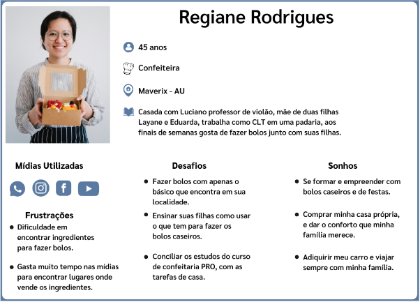

# 2 Especificações do Projeto

Pré-requisitos: <a href="1-Documentação de Contexto.md"> Documentação de Contexto</a>

Visando melhor entendimento da proposta do projeto entrevistamos duas pessoas que sempre precisa de um serviço ou necessita de comprar um produto no estabelecimento da sua cidade.

## 2.1. Personas

Na figura 01 temos a descrição da persona que busca serviços para satisfazer suas necessidades residenciais. 

<h2 align="center"> FIGURA 01</h2>
 

Na figura 02 temos a descrição de uma persona que busca comércios locais para comparar preços de produtos que ela almeja adquirir e divulgar seu futuro negócio.

<h2 align="center"> FIGURA 02</h2>

## 2.2. Histórias de usuários

A partir da compreensão do dia a dia das personas identificadas para o projeto, foram registradas as seguintes histórias de usuários.

Com base na análise das personas forma identificadas as seguintes histórias de usuários:

| EU COMO... `PERSONA` | QUERO/PRECISO ... `FUNCIONALIDADE`                                            | PARA ... `MOTIVO/VALOR`                                     |
| -------------------- | ----------------------------------------------------------------------------- | ----------------------------------------------------------- |
| Marcos Nunes         | Quero poder buscar por profissionais de perto de onde será realizada a obra   | Para poder calcular o custo com transporte                  |
| Marcos Nunes         | Desejo obter os dados de contato em evidência                                 | Para entrar em contato caso goste do perfil do profissional |
| Marcos Nunes         | Desejo buscar por especialidade                                               | Para encontrar tudo em um mesmo lugar                       |
| Regiane Rodrigues    | Desejo ter opção de comentar e ler opiniões de outras pessoas sobre o produto | Para ter mais confiança em adquirir o produto               |
| Regiane Rodrigues    | Desejo que as empresas cadastradas forneçam os detalhes de suas mercadorias   | Para comparar com outros fornecedores                       |
| Regiane Rodrigues    | Desejo que o site tenha um layout adaptável                                   | Para poder acessar de vários dispositivos                   |

Apresente aqui as histórias de usuário que são relevantes para o projeto de sua solução. As Histórias de Usuário consistem em uma ferramenta poderosa para a compreensão e elicitação dos requisitos funcionais e não funcionais da sua aplicação. Se possível, agrupe as histórias de usuário por contexto, para facilitar consultas recorrentes à essa parte do documento.

## 3 LISTA DE REQUISITOS

Para que o usuário possa interagir juntamente com o site é necessária uma lista de requisitos para que o mesmo tenha uma experiência e almeje voltar interagir e até mesmo compartilhar com demais usuários sua experiência. Os requisitos são fundamentais para que o site funcione conforme o desejo do cliente, trazendo consigo comodidade e satisfação em cada interação.

### 3.1 Requisitos funcionais

A tabela a seguir apresenta os requisitos do projeto, identificando a prioridade em que os mesmos devem ser entregues.

| ID     | Descrição do Requisito                                                                                                                                                     | Prioridade |
| ------ | -------------------------------------------------------------------------------------------------------------------------------------------------------------------------- | ---------- |
| RF-001 | O sistema, em sua página principal na web, deverá apresentar as empresas ou prestadores de serviços mais próximos à localização do cliente(pessoa jurídica ou física) que acessou a página.           | ALTA       |
| RF-002 | O sistema deve permitir ao cliente pesquisar por empresas, produtos ou serviços cadastrados no sistema.                                                                    | ALTA       |
| RF-003 | O sistema deverá filtrar as buscas por cidade.                                                                                                                              | MÉDIA      |
| RF-004 | O sistema deve permitir ao cliente filtrar o resultado de pesquisas por categoria, e por estado de funcionamento (aberto ou fechado), no horário em que a busca for feita. | MÉDIA      |
| RF-005 | O sistema deve permitir o cadastro de cliente do tipo pessoa física, e cliente do tipo pessoa juridica.                                                                                                                         | ALTA       |
|  RF-006 | O formulário de cadastro deverá conter os campos de entrada: NOME DE USUÁRIO, EMAIL e SENHA.                                                               | BAIXA       |
|  RF-007| O sistema não deve permitir o cadastro de empresas por clientes menores de 18 anos. | BAIXA       |
| RF-008 | O sistema deve permitir ao cliente fazer login com nome de usúario ou email e senha.                                                                                                                            | MÉDIA       |
| RF-009 | O sistema deve permitir ao cliente editar seus dados cadastrais.                                                                                                           | BAIXA       |
| RF-010 | O sistema deve permitir ao cliente criar uma nova senha, caso não saiba sua senha de login.                                                                                | BAIXA      |
| RF-011 | O sistema deve permitir que pessoas juridicas previamente cadastradas, criem página(s) na plataforma, para divulgação de sua empresa, produto(s) ou serviço(s).                              | ALTA       |
| RF-012 | Antes de criar a primeia página, a empresa deverá preencher um formulario, contendo os campos: RAZÃO SOCIAL, CNPJ, LOGRADOURO, BAIRRO, MUNICÍPIO, ESTADO, CEP, TELEFONE, EMAIL para contato. Poderá também, fazer o upload de uma foto pessoal ou de sua logomarca, caso tenha uma.| ALTA       |
| RF-013 | O sistema deve permitir a edição da página criada para a divulgação de produto ou serviço, pela pessoa juridica que a criou                                                | MÉDIA      |
| RF-014 | O sistema deve permitir ao usuário adicionar empresas, produtos ou serviços, em sua lista de favoritos, que está disponível em seu perfil.                                 | ALTA       |
| RF-015 | O sistema deve permitir a pessoa física e jurídica remover empresas, produtos ou serviços da sua lista de favoritos, que estará disponível em seu perfil.                                    | MÉDIA      |
| RF-016 | O formulario para criação de página possuirá campos editaveis, e com instruções de como a empresa poderá montar sua página.   | ALTA      | 
| RF-017 | Nos campos destinados ao envio de imagens, o sistema deve permitir o upload de imagens JPEG/JPG, GIF, PNG, TIFF e SVG.                                                                                                | MÉDIA      |
| RF-018 | O sistema disponibilizará o endereço da página na web para a empresa que a criou.                                                                                                      | MÉDIA      |
| RF-019 | O sistema disponibilizará na(s) página(s) da pessoa jurídica, através da API de mapas do Microsoft Bing, um mapa informando sua localização comercial.                             | BAIXA      |

### 3.2 Requisitos não Funcionais

A tabela a seguir apresenta os requisitos não funcionais que o projeto deverá atender.

| ID      | Descrição do Requisito                                                                                                                                                                                                                                                                                 | Prioridade |
| ------- | ------------------------------------------------------------------------------------------------------------------------------------------------------------------------------------------------------------------------------------------------------------------------------------------------------ | ---------- |
| RNF-001 | O site deverá ser compatível com os principais navegadores do mercado (Google Chrome, Firefox, Microsoft Edge).                                                                                                                                                                                          | ALTA       |
| RNF-002 | O site deverá ser responsivo, permitindo a visualização em diferentes tamanhos de tela de forma adequada.                                                                                                                                                                                                                | MÉDIA       |
| RNF-003 | O site deverá ter interface de usúario de facil entendimento.                                                                                                                                                                                         | MÉDIA       |
| RNF-004 | A senha para acesso ao perfil do cliente, deve conter pelo menos 7 caracteres.                                                                                                                                                                                          | ALTA       |
| RNF-005 | O sistema dará status de cliente-empresa ao usuário que divulgar sua empresa, produto ou serviço.                                                                                                                                                                                                      | MÉDIA       |
| RNF-006 | O sistema deverá estar disponivel 24 horas por dia, todos os dias da semana.                                                                                                                                                                                                      | ALTA       |

### 3.3 Restrições

As questões que limitam a execução desse projeto e que se configuram como obrigações claras para o desenvolvimento do projeto em questão são apresentadas na tabela a seguir.

| ID      | Descrição do Requisito                                                                                        |
| ------- | ------------------------------------------------------------------------------------------------------------- |
| RE-001 |O sistema deve se restringir às tecnologias básicas da Web no Front-end.                                        |
| RE-002 | A implementação do sistema deverá ser feita até o dia 11/12/2022, não podendo extrapolar a data.              |
