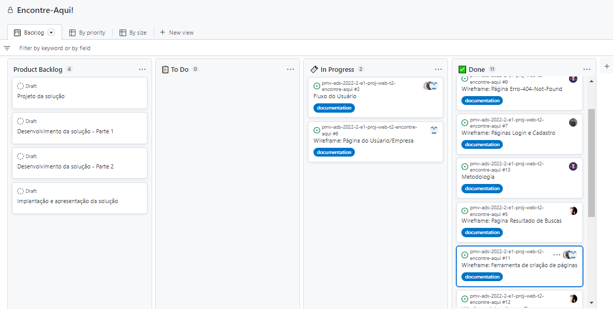

# 3 Metodologia

Pré-requisitos: <a href="2-Especificação do Projeto.md"> Documentação de Especificação</a>

A metodologia do nosso projeto foi implementada através de ferramentas de administração seja para descrever o passo a passo para definir o que cada um da equipe vai fazer e até mesmo para armazenar nosso código-fonte que será introduzido.

## 3.1. Ambientes de trabalho

Para termos controle simplificado e objetivo mediante nossos artefatos desenvolvidos, utilizamos plataformas que nos auxilia nesse quesito, seja para hospedar nosso repositório e até mesmo nossa documentação e a gestão da equipe, segue abaixo onde encontrar cada um desses artefatos:

| AMBIENTE                          | PLATAFORMA        | LINK DE ACESSO |
| ----------------------------------|-------------------|----------------|
| Repositório de código fonte       | GitHub            | [Git.Icei](https://github.com/ICEI-PUC-Minas-PMV-ADS/pmv-ads-2022-2-e1-proj-web-t2-encontre-aqui)
| Documentação de contexto          | GitHub            | [Doc.Contexto](https://github.com/ICEI-PUC-Minas-PMV-ADS/pmv-ads-2022-2-e1-proj-web-t2-encontre-aqui/blob/main/docs/01-Documenta%C3%A7%C3%A3o%20de%20Contexto.md)
| Especificações do Projeto         | GitHub            | [Esp.Projeto](https://github.com/ICEI-PUC-Minas-PMV-ADS/pmv-ads-2022-2-e1-proj-web-t2-encontre-aqui/blob/main/docs/02-Especifica%C3%A7%C3%A3o%20do%20Projeto.md)
| Projeto de Interface e Wireframes | Figma             | [UserFlow](https://www.figma.com/file/bVtZWbFrOazzYkKon3pfYU/User-Flow?node-id=0%3A1)-[Wireframes-Iterativo](https://www.figma.com/file/C3rO7ZKhziujxrIGvQmqiV/Final?node-id=0%3A1806)
| Gerenciamento de projetos         | GitHub - Projects | [Gerenc.Projetos](https://github.com/orgs/ICEI-PUC-Minas-PMV-ADS/projects/133/views/1)

## 3.2. Gerenciamento do Projeto

Para alcançar os objetivos previstos utilizamos a metodologia agil, chamada Scrum, onde os processos são introduzidos através de incremento + interação com nosso cliente facilitando assim o engajamento entre a equipe, que é contemplada por um Product Owner, o Scrum Master e os desenvolvedores.

Sendo assim a nossa equipe está distribuida da seguinte forma:

<ul>
  <li>Product Owner: Paulo Bandeira</li>
  <li>Scrum Master: Pedro Ítalo</li>
  <li>Equipe de desenvolvimento</li>
 - Camila Larissa
 - Marcos Paulo
 - Renê Matias
 </ul>
 
 #
 
 
Para organização e distribuição das tarefas do projeto, estamos utilizando o Projects do GitHub, estruturado com as seguintes listas:

 <ul>
  <li>Backlog: ambiente onde colocamos todas as atividades a serem desenvolvidas no projeto que estamos trabalhando, sendo administrada por nosso Product Owner.</>
  <li>To do: é a lista de sprint backlog que contempla o que vamos dar prioridade na execução.</li>
  <li>In Progress: é a relação de tarefas que estamos trabalhando atualmente.</li>
  <li>Done: os artefatos que são movidos para cá já foram validados juntamente com a equipe e está pronto para ser entregue para o cliente avaliar, não sendo mais necessário nenhum teste ou modificação.</li>

  

 
  

<h3 align="center">FIGURA 01</h3>

 

