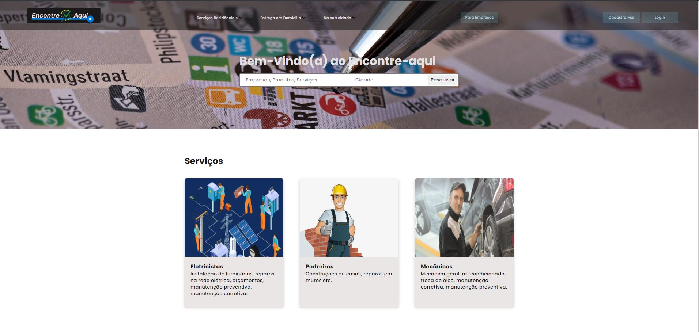
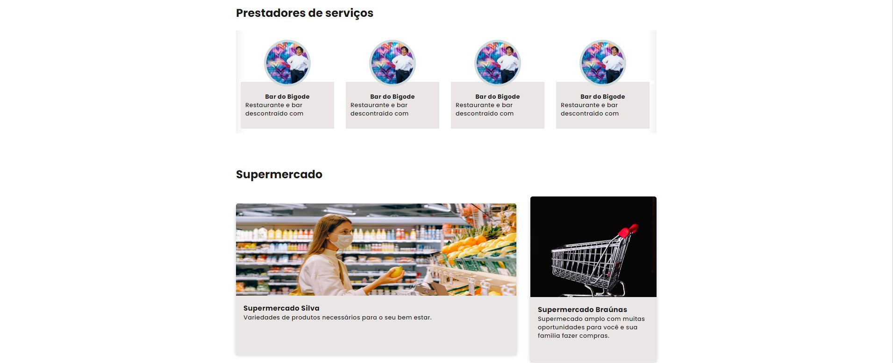
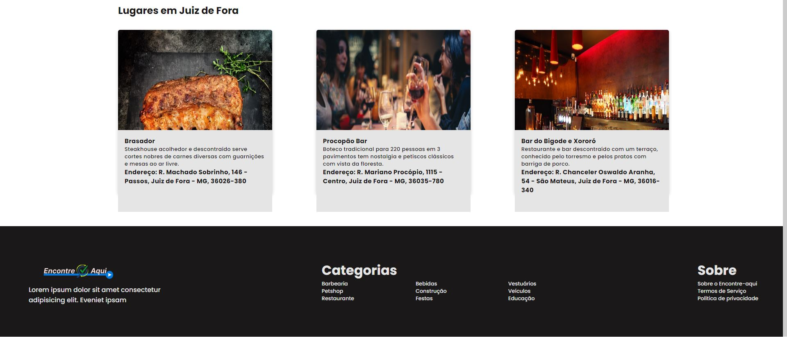

# Template padrão do site

 O template padrão do sistema foi desenvolvido e fixado em dois modelos:

 
  

<h3 align="center">FIGURA X - 1° Template padrão</h3>

O template desenvolvido está presente no site <a href="#">GitHub Pages</a>
  

No template da figura X é contemplado os seguintes layouts: 

  <ul>
    <li>Homepage</li>
    <li>Alterar senha</li>
    <li>Recuperar senha</li>
    <li>Cadastro de usuário</li>
    <li>Login de usuário</li>
    <li>Formulário inicial para adição de páginas</li>
    <li>Perfil do usuário</li>
    <li>Editar perfil do usuário</li>
    <li>Publicar página no sistema</li>
    <li>Divulgação do profissional ou empresa</li>
    <li>Criar páginas</li>
    <li>Perfil do usuário-empresa</li>
    <li>Editar usuário divulgador</li>
    <li>Edição de página de produto ou serviço</li>
    <li>Divulgação de produto ou serviço</li>
  </ul>
 
 
As imagens abaixos estão relacionadas aos layouts do 1° template padrão, nela está demonstrando a homepage, contendo a  identidade visual, aspectos de responsividade e iconografia. 

 
 
 
  

 
 
  

 
 
  

 
 #
 
  
No template da figura Y é comtemplado um único layout: 

  <ul>
    <li>Resultados de pesquisas</li>
  </ul>
  
  
 
  

<h3 align="center">FIGURA Y - 2° Template padrão</h3>

#

Pré-requisitos: <a href="2-Especificação do Projeto.md"> Especificação do Projeto</a>, <a href="3-Projeto de Interface.md"> Projeto de Interface</a>, <a href="4-Metodologia.md"> Metodologia</a>

Layout padrão do site (HTML e CSS) que será utilizado em todas as páginas com a definição de identidade visual, aspectos de responsividade e iconografia.

> **Links Úteis**:
>
> - [CSS Website Layout (W3Schools)](https://www.w3schools.com/css/css_website_layout.asp)
> - [Website Page Layouts](http://www.cellbiol.com/bioinformatics_web_development/chapter-3-your-first-web-page-learning-html-and-css/website-page-layouts/)
> - [Perfect Liquid Layout](https://matthewjamestaylor.com/perfect-liquid-layouts)
> - [How and Why Icons Improve Your Web Design](https://usabilla.com/blog/how-and-why-icons-improve-you-web-design/)
