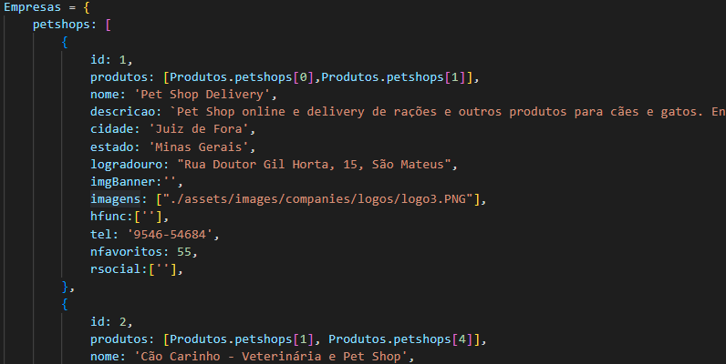
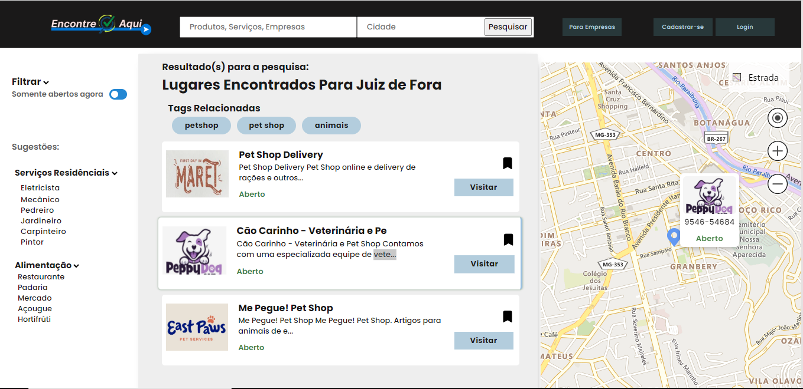
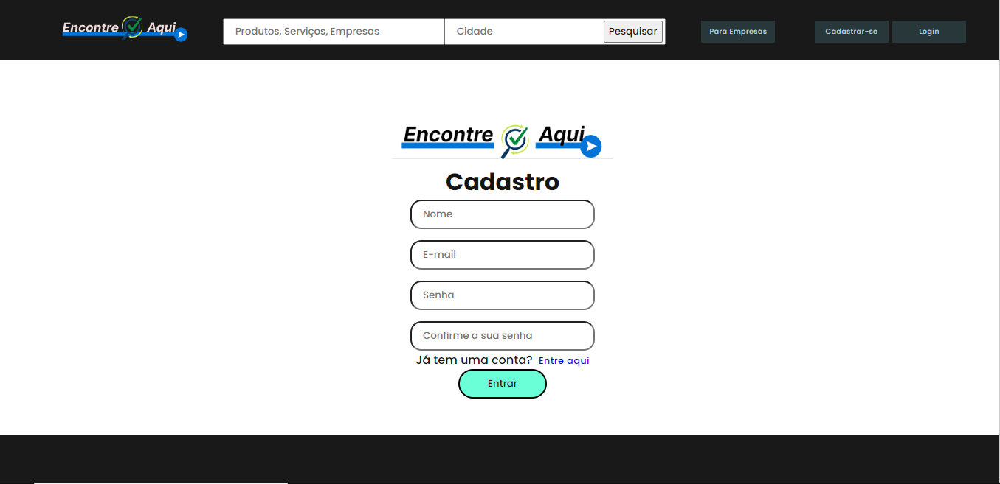
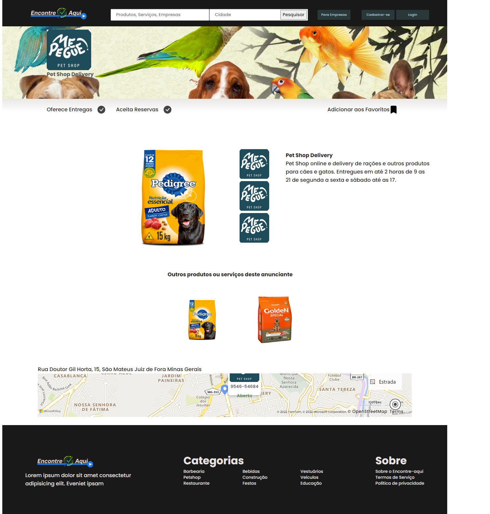

# Programação de Funcionalidades

<h3>Home Page - RF-001, RF-003, RF-005, RF-006 e RF-008</h3>

A tela inicial do site trás uma visão ampla para o usuário, onde é possível fazer pesquisas sobre profissionais desejados ou comercios da sua localização atual, proporciona também a possibilidade de se cadastrar como pessoa física e do tipo pessoa juridica. As informações de localização estão armazenadas no LocalStorage, juntamente com as informações de usuário cadastrado. Na figura X abaixo é apresentada a tela da home, conforme descrição acima.

 
  

##### _Figura 1- Home Page_

<h3>Requisitos atendidos</h3>
<ul>
  <li>RF-001</li>
  <li>RF-003</li>
  <li>RF-005</li>
  <li>RF-006</li>
  <li>RF-008</li>
</ul>

<h3>Artefatos da funcionalidade</h3>  
<ul>
  <li>index.html</li>
  <li>carousel.js</li>
  <li>carousel.css</li>
  <li>global.css</li>
  <li>home.css</li>
</ul>

<h3>Estrutura de dados</h3>

 Os dados de empresas, produtos, serviços e usuários são manipulados em objetos e vetores de objetos da linguagem javascript.  Exemplo na figura a seguir.  

 
  

##### _Figura 2- Estrutura de dados_

<h3>Instruções de acesso</h3>
1. Abra o navegador de internet em seu dispositivo móvel ou desktop e digite a URL: https://pauloosilas.github.io/pmv-ads-2022-2-e1-proj-web-t2-encontre-aqui/

<h3>Resultados de pesquisas - RF-002, RF-003 e RF-004</h3>

A tela de resultados de pesquisa permite ao usuário fazer pesquisas detalhadas de acordo com sua necessidade, onde o armazenamento das informações que ele busca está no LocalStorage, juntamente com uma API do BING maps, facilitando assim encontrar o que almeja com precisão de sua localização atual.

 
  

##### _Figura 3- Página Contendo Resultado de pesquisas_

<h3>Requisitos atendidos</h3>
<ul>
  <li>RF-002</li>
  <li>RF-003</li>
  <li>RF-004</li>
</ul>

<h3>Artefatos da funcionalidade</h3>  
<ul>
  <li>search.html</li>
  <li>search.css</li>
  <li>global.css</li>
  <li>mapa-v1.js</li>
  <li>database.js</li>
  <li>findData.js</li>
  <li>responsive.js</li>
</ul>

<h3>Estrutura de dados</h3>

 Os dados de empresas, produtos, serviços e usuários são manipulados em objetos e vetores de objetos da linguagem javascript.  Exemplo na figura a seguir.  

 
  

##### _Figura 4- Estrutura de dados_

<h3>Instruções de acesso</h3>

1. Ao pesquisar por empresas, produtos ou serviços em qualquer página do site, o cliente será direcionado para esta página, contendo os resultados da pesquisa efetuada;
2. A página pode ser acessada pelo endereço https://pauloosilas.github.io/pmv-ads-2022-2-e1-proj-web-t2-encontre-aqui/src/search.html;

<h3>Página de Login - RF-008</h3>

A página de Login permite ao usuário acessar a sua página de perfil. A página utiliza dados armazenados no localStorage para validação de dados

 
  

##### _Figura 5- Página Contendo Resultado de pesquisas_

<h3>Requisitos atendidos</h3>
<ul>
  <li>RF-008</li>
</ul>

<h3>Artefatos da funcionalidade</h3>  
<ul>
  <li>login.html</li>
  <li>login.css</li>
  <li>global.css</li>
  <li>login.js</li>
</ul>

<h3>Estrutura de dados</h3>

 Os dados de empresas, produtos, serviços e usuários são manipulados em objetos e vetores de objetos da linguagem javascript.  Exemplo na figura a seguir.  

 

<h3>Instruções de acesso</h3>

1. Ao clicar no botão Login, disponivel caso o cliente não esteja logado, localizado no topo das páginas.
2. A página pode ser acessada pelo endereço https://pauloosilas.github.io/pmv-ads-2022-2-e1-proj-web-t2-encontre-aqui/src/login.html;

 

<h3>Página de Cadastro de Clientes - RF-005, RF-006, RF-007 </h3>

A página de Cadastro permite ao usuário cadastrar-se no sistema e acessar funcionalidades do site. A página armazena dados do cliente no localStorage para uso posterior dentro da plataforma 

 
  

##### _Figura 7- Página de Cadastro_

<h3>Requisitos atendidos</h3>
<ul>
  <li>RF-005</li>
  <li>RF-006</li>
  <li>RF-007</li>
</ul>

<h3>Artefatos da funcionalidade</h3>  
<ul>
  <li>cadastro.html</li>
  <li>login.css</li>
  <li>global.css</li>
  <li>cadastro.js</li>
</ul>

<h3>Estrutura de dados</h3>

 Os dados de empresas, produtos, serviços e usuários são manipulados em objetos e vetores de objetos da linguagem javascript.  Exemplo na figura a seguir.  

 

<h3>Instruções de acesso</h3>

1. Ao clicar no botão cadastre-se, disponivel caso o cliente não esteja logado, localizado no topo das páginas.
2. A página pode ser acessada pelo endereço [https://pauloosilas.github.io/pmv-ads-2022-2-e1-proj-web-t2-encontre-aqui/src/login.html](https://pauloosilas.github.io/pmv-ads-2022-2-e1-proj-web-t2-encontre-aqui/src/cadastro.html);

<h3>Página de Visualização de Produto ou Serviço </h3>

Ao clicar em um resultado da pesquisa, o cliente é direcionado para esta página.

 
  

##### _Figura 7- Página de Visualização de Produto ou Serviço_

<h3>Requisitos atendidos</h3>
<ul>
  <li>RF-019</li>
</ul>

<h3>Artefatos da funcionalidade</h3>  
<ul>
  <li>produto.html</li>
   <li>mapa-v1.js</li>
  <li>findProducts.js</li>
  <li>database.js</li>
  <li>prod-serv.css</li>
  <li>global.css</li>
  <li>card-map.css</li>
</ul>

<h3>Estrutura de dados</h3>

 Os dados de empresas, produtos, serviços e usuários são manipulados em objetos e vetores de objetos da linguagem javascript.  Exemplo na figura a seguir.  

 
  

##### _Figura 8- Estrutura de dados_

<h3>Instruções de acesso</h3>

1. A página pode ser acessada atravez de um clique do botão visualizar, em um dos resultados da pesquisa.
2. A página pode ser acessada pelo endereço: https://pauloosilas.github.io/pmv-ads-2022-2-e1-proj-web-t2-encontre-aqui/src/produto.html?categoria=petshop&&id=1
