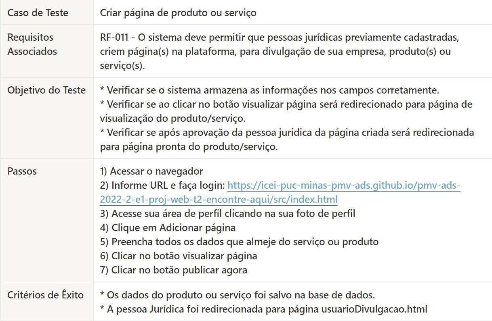

# Plano de Testes de Software

## Testes Funcionais de Software.

### Cadastro do Cliente

 
  

##### _Figura 1- Teste Cadastro de Pessoa Física_

 
  

##### _Figura 2- Teste Cadastro de Pessoa Jurídica_

### Criar Página de divulgação de produto ou serviço pessoa Jurídica

 
  

##### _Figura 3- Teste Criar página de divulgação_
