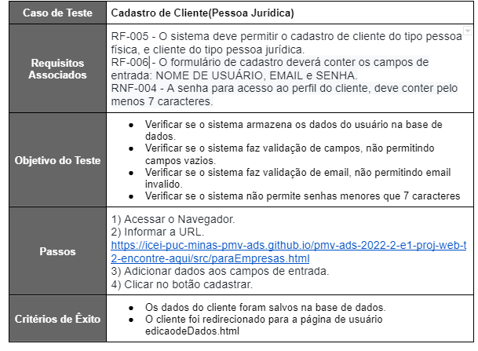

# Plano de Testes de Software

## Os requisitos para realização dos testes de software são:

- Site publicado na Internet
- Browser que podem ser utilizados – Chrome, Firefox ou Edge
- Conectividade de Internet para acesso às plataformas (APISs)

## Testes Funcionais de Software.

### Cadastro do Cliente - Paulo

 
  

##### _Figura 1- Teste Cadastro de Pessoa Física_

 
  

##### _Figura 2- Teste Cadastro de Pessoa Jurídica_

### Registro de Teste: Realizar Login. - Renê Matias

 
  

##### _Figura 3- Teste de Login de clientes_

### Criar Página de divulgação de produto ou serviço pessoa Jurídica - Pedro

 
  

##### _Figura 4- Teste Criar página de divulgação_

### Registro de Teste: Adicionar e Remover Favoritos. - Renê Matias

 
  

##### _Figura 5- Adicionar e Remover Favoritos_

### Registro de Teste: Serviços Residenciais e entregas domiciliar. - Camila

 
  

##### _Figura 6- Serviços Residenciais e entregas domiciliar_
