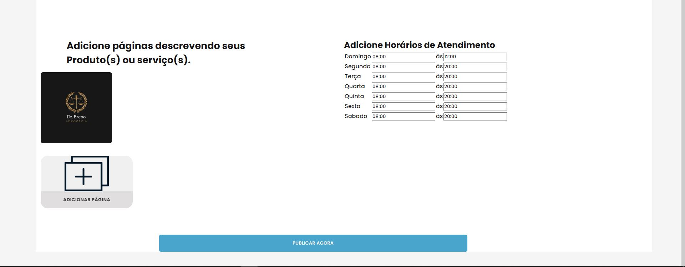

# Registro de Testes de Software

## Registro de Teste: Cadastro de Pessoa Física

### Caso de Sucesso

 O sistema cadastrou o cliente na base de dados(localStorage) 

 
  

##### _Figura 1- Registro de Teste para Pessoa Física_

 O sistema direcionou o cliente para a página de Perfil de Usuário 

 
  

##### _Figura 2- Cliente Direcionado para página de Perfil_

## Registro de Teste: Criar Página de divulgação de produto ou serviço pessoa Jurídica

### Caso de Sucesso

 O sistema cadastrou o produto/serviço na base de dados(localStorage) 

 
  

##### _Figura 3- Registro de Teste dados de armazenamento de produto/serviço cadastrado_

 O sistema direcionou o cliente para a página de Perfil de Usuário 

 
  

