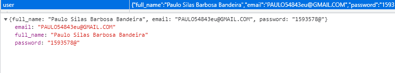
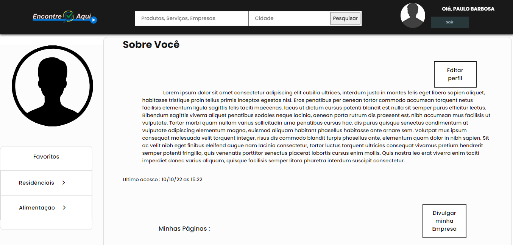

# Registro de Testes de Software

## Registro de Teste: Cadastro de Pessoa Física

### Caso de Sucesso

 O sistema cadastrou o cliente na base de dados(localStorage) 

 
  

##### _Figura 1- Registro de Teste para Pessoa Física_

 O sistema direcionol o cliente para a página de Perfil de Usuário 

 
  

##### _Figura 2- Registro de Teste para Pessoa Física_
