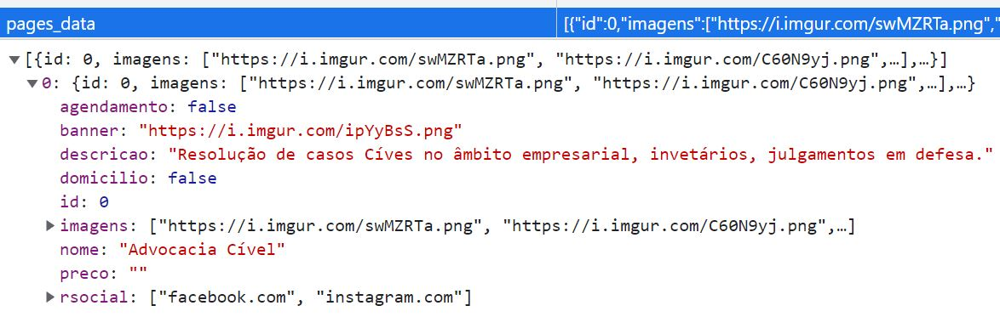
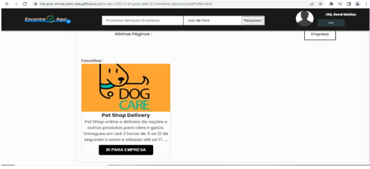

# Registro de Testes de Software

## Registro de Teste: Cadastro de Pessoa Física

### Caso de Sucesso

 O sistema cadastrou o cliente na base de dados(localStorage) 

 
  

##### _Figura 1- Registro de Teste para Pessoa Física_

 O sistema direcionou o cliente para a página de Perfil de Usuário 

 
  

##### _Figura 2- Cliente Direcionado para página de Perfil_

## Registro de Teste: Criar Página de divulgação de produto ou serviço pessoa Jurídica

### Caso de Sucesso

 O sistema cadastrou o produto/serviço na base de dados(localStorage) 

 
  

##### _Figura 3- Registro de Teste, dados de armazenamento de produto/serviço cadastrado_

 O sistema direcionou a pessoa jurídica para a página de publicar página 

 
  

##### _Figura 4- Registro de Teste, sistema redirecionou a pessoa jurídica para a página de publicar página_

## Registro de Teste: Login de Cliente(Pessoa Física e Jurídica)

### Caso de Sucesso

 O sistema realizou o login do cliente com a base de dados salvos (localStorage)  

 
  

##### _Figura 5- Registro de Teste, dados de armazenamento realizado no login._

 O Sistema informou mensagens de indicação de e-mail e senha inválidos. 

 
  

##### _Figura 6- Registro de Teste, mensagem de indicação de senha inválida._

  Registro de Teste, mensagem de indicação de e-mail inválido. 

 
  

##### _Figura 7- Registro de Teste, mensagem de indicação de e-mail inválido._

 Registro de Teste, mensagem de indicação de e-mail inválido. 

 
  

##### _Figura 8- Registro de Teste, mensagem de indicação de e-mail e senha inválidos._

## Registro de Teste: Adicionar e Remover aos favoritos

### Caso de Sucesso

 O sistema realizou a adição e remoção de empresas, serviços e produtos da lista de favoritos com a base de dados salvos (localStorage)  

 
  

##### _Figura 9- Registro de Teste, adição de empresas, produtos e serviços a lista de favoritos._

 Sistema mostra a adição e remoção de empresas, produtos e serviços a lista de favoritos na página de pefil do cliente. 

 
  

##### _Figura 10- Registro de Teste, adição de empresas, produtos e serviços a lista de favoritos._

 
  

##### _Figura 11- Registro de Teste, remoção de empresas, produtos e serviços a lista de favoritos_

## Registro de Teste: Editar Página de Divulgação de Produto ou Serviço.

### Caso de Sucesso

 O sistema carregou as informações já cadastradas anteriormente pelo cliente, na página de edição.  

 
  

##### _Figura 12- Registro de Teste, Página de Edição._

 O sistema fez alterações na base de dados(localStorage), de acordo com os dados informados na página de edição, pelo cliente 

 
  

##### _Figura 13- Registro de Teste, localStorage, Página sem Edição._

 
  

##### _Figura 14- Registro de Teste,Página sem Edição._

 
  

##### _Figura 15- Registro de Teste, localStorage, Página Editada._

 
  

##### _Figura 16- Registro de Teste,Página Editada._
