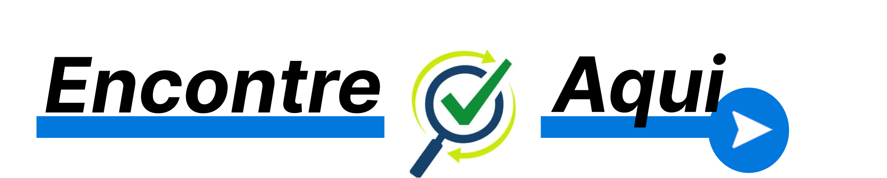

# Apresentação

## Título do Projeto

# Encontre-Aqui

## Identidade Visual (Marca, Design)

Logo

 
  

##### _Figura 1- Logomarca._

 
  

##### _Figura 2- Logomarca._

## Conjunto de Slides (Estrutura)

Link da apresentação

<a href="../presentation/Apresentação.pdf">Apresentação</a>

## Vídeo de Apresentação do Projeto.

[Video Demonstração do Projeto](https://github.com/ICEI-PUC-Minas-PMV-ADS/pmv-ads-2022-2-e1-proj-web-t2-encontre-aqui/blob/main/presentation/Sistema-Encontre.mp4)

https://user-images.githubusercontent.com/11765315/206882738-b5807520-7ecf-4ed1-915b-f5d0d8ff1d7c.mp4

